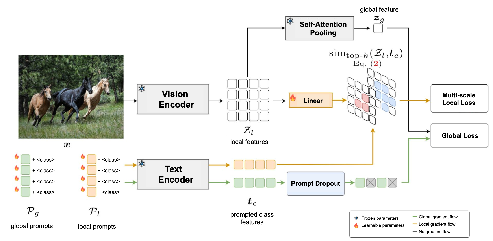

# GalLoP: Learning Global and Local Prompts for Vision-Language Models
This is the official PyTorch implementation of the ECCV 2024 paper : [GalLoP: Learning Global and Local Prompts for Vision-Language Models](https://arxiv.org/pdf/2407.01400)



## Installation
To install gallop and all the dependencies please use the following commands:
```
python3 -m venv .venv
source .venv/bin/activate
pip install -U pip
pip install -e .
```

## Datasets
Please follow instructions in the [CoOp](https://github.com/KaiyangZhou/CoOp/blob/main/DATASETS.md) repository to download the datasets used for the few-shot image classification and domain generalization experiments. Note that downloading the class names and splits (e.g. `split_zhou_Caltech101.json`) is not required as there are already included in the `gallop/datasets` folder. For the out-of-distribition experiments, we use the OOD datasets [iNaturalist](https://arxiv.org/abs/1707.06642), [SUN](https://vision.princeton.edu/projects/2010/SUN/), [Places](https://arxiv.org/abs/1610.02055), and [Texture](https://arxiv.org/abs/1311.3618) curated by [Huang et al. 2021](https://arxiv.org/abs/2105.01879). PLease follow instructions from this [repository](https://github.com/deeplearning-wisc/large_scale_ood#out-of-distribution-dataset) to download the datasets.

The overall file structure is as follows:

The directory structure where all the datasets are stored should look like this:

```
$DATA_FOlDER/
|––––Imagenet/
|––––––––train/
|––––––––val/
|––––imagenetv2-matched-frequency-format-val/
|––––imagenet-a/
|––––imagenet-r/
|––––sketch/
|––––caltech101/
|––––––––101_ObjectCategories/
|––––EuroSAT_RGB/
|––––dtddataset/
|––––––––dtd/
|––––––––––––images/
|––––fgvc-aircraft-2013b/
|––––flowers102/
|––––food-101/
|––––––––images/
|––––oxford-iiit-pet/
|––––––––images/
|––––stanford_cars/
|––––SUN397/
|––––UCF-101-midframes/
|––––ood_data/
|––––––––iNaturalist/
|––––––––SUN/
|––––––––Places/
|––––––––dtd/
|––––––––––––images/


```

## Training

We provide training scripts in the `scripts` folder. For instance, to launch the training on Imagenet with the ViT-B/16 backbone and with 16 shots do:
```
./scripts/run_imagenet.sh
```
Note that you may adapt the values of `CUDA_VISIBLE_DEVICES` and `checkpointing_segments` to launch on your own GPUs. For reference, we trained the Imagenet ViT-B/16 model on 2 NVIDIA RTX A6000 in approx. 6h 38 min.

## Evalution
Here is a simple snippet code illustrating how to perform inference with gallop:

```python
import torch
from PIL import Image
from clip.clip import _transform

import gallop.lib as lib
from gallop.vlprompt import GalLoP

checkpoint_path = "your_ckpt_path" # Ajust the path and name to the checkpoint if needed.

device = "cuda" if torch.cuda.is_available() else "cpu"
val_transform = _transform(224)

model = GalLoP(clip_name="clip_vit_b16", n_global_prompts=4, n_local_prompts=4)
lib.load_checkpoint(model, checkpoint_path)

model.to(device)
image = val_transform(Image.open(".github/horses.png")).unsqueeze(0).to(device)
class_names = ["horses", "dogs", "cats"]

with torch.no_grad():
    # Compute text features from global and local prompts:
    text_features, local_text_features = model.encode_text(class_names)
    text_features /= text_features.norm(dim=-1, keepdim=True)
    local_text_features /= local_text_features.norm(dim=-1, keepdim=True)

    # Compute global and local logits from global and local visual features:
    global_logits, local_logits = model(image, text_features=text_features, local_text_features=local_text_features)

    # Compute out-of-distribution score using Global-Local Maximum Concept Matching:
    ood_scores = model.compute_scores(global_logits, local_logits, ood_method="GL-MCM")

    # Perform ensembling of logits to obtain final class probabilities
    probs, _, _ = model.create_prediction_scores(global_logits, local_logits)

print("Label probs:", probs.cpu().numpy())
print("OOD score:", ood_scores)
```

To run the full evaluation of GalLoP (accuracy, ood detection and ood generalization) on the Imagenet ViT-B/16 checkpoint please run the following script (you may need to change the path and/or name to the checkpoint):
```
./scripts/eval_imagenet.sh "your_ckpt_path"
```

## Few-shots classification results (ViT-B/16, 16 shots)

|  Dataset  | Imagenet |  Caltech  |   Pets   |   Cars   |  Flowers  | Food     | Aircraft |   SUN    |  DTD   | Eurosat  |   UCF   | Average  |
|:----------|:--------:|:---------:|:--------:|:--------:|:---------:|:--------:|:--------:|:--------:|:------:|:--------:|:-------:|:--------:|
| CLIP      |   66.7   |   92.2    |   88.4   |   65.5   |    70.7   |  84.8    |   24.8   |   62.3   |  44.1  |   48.3   |   64.7  |   75.7   |
| CoOp      |   71.7   |   95.6    |   91.9   |   83.1   |    97.1   |  84.2    |   43.4   |   74.7   |  69.9  |   84.9   |   82.2  |   79.9   |
| PLOT      |   72.6   |   96.0    |   93.6   |   84.6   |    97.6   | **87.1** |   46.7   |   76.0   |  71.4  |   92.0   |   85.3  |   82.1   |
| PromptSRC |   73.2   |   96.1    |   93.7   |   85.8   |    97.6   |  86.5    |   50.8   | **77.2** |  72.7   | **92.4** |   86.5  |   82.9   |
| **GalLoP**| **75.1** | **96.7**  | **94.1** | **89.2** |  **98.8** |  86.5    | **58.3** | **77.2** |**75.5**|   90.1   | **86.9**| **84.4** |

## Imagenet domain generalization results (ViT-B/16, 16 shots)

|  Dataset  | Imagenet |  Imagenet-V2  |   Imagenet-S  |   Imagenet-A |  Imagenet-R | Average  |
|:----------|:--------:|:-------------:|:-------------:|:------------:|:-----------:|:--------:|
| CLIP      |   66.7   |     60.8      |     46.2      |     47.8     |     74.0    |   57.2   |
| CoOp      |   71.7   |     64.6      |     47.9      |     49.9     |     75.1    |   59.4   |
| PLOT      |   72.6   |     64.9      |     46.8      |     48.0     |     73.9    |   58.4   |
| PromptSRC |   71.3   |     64.4      |   **49.6**    |   **50.9**   |   **77.8**  |   60.7   |
| **GalLoP**| **75.1** |   **67.5**    |   **49.5**    |     50.3     |   **77.8**  | **61.3** |


## Imagenet out-of-detection results (ViT-B/16, 16 shots)

|      Dataset    |     Imagenet <br> <sub>Accuracy</sub>     |    iNaturalist<br> <sub>FPR95 \/ AUC</sub>   |      SUN <br> <sub>FPR95 \/ AUC</sub>    |     Places <br> <sub>FPR95 \/ AUC</sub>  |    Textures <br> <sub>FPR95 \/ AUC</sub>  |    Average <br> <sub>FPR95 \/ AUC</sub>  |
|:--------------------------|:-----------------:|:----------------:|:------------:|:------------:|:-------------:|:------------:|
| CLIP <sub>(MCM)</sub>     |        66.7       |     30.9 \/ 94.6 | 37.7 \/ 92.6 | 44.8 \/ 89.8  | 57.9 \/ 86.1 | 42.8 \/ 90.8 |
| CLIP <sub>(GL-MCM)</sub>  |        66.7       |     15.2 \/ 96.7 | 30.4 \/ 93.1 | 38.9 \/ 89.9  | 57.9 \/ 83.6 | 35.5 \/ 90.8 |
| CoOp <sub>(MCM)</sub>     |        71.7       |     28.0 \/ 94.4 | 37.0 \/ 92.3 | 43.0 \/ 89.7  | 39.3 \/ 91.2 | 36.8 \/ 91.9 |
| CoOp <sub>(GL-MCM)</sub>  |        71.7       |     14.6 \/ 96.6 | 28.5 \/ 92.7 | 36.5 \/ 90.0  | 43.1 \/ 88.0 | 30.7 \/ 91.8 |
| PLOT                      |        72.6       |     15.9 \/ 96.6 | 33.7 \/ 92.8 | 38.2 \/ 91.0  | 39.2 \/ 90.2 | 31.8 \/ 92.7 |
| LoCoOp <sub>(MCM)</sub>   |        71.5       |     23.1 \/ 95.5 | 32.7 \/ 93.4 | 39.9 \/ 90.6  | 40.2 \/ 91.3 | 34.0 \/ 92.7 |
| LoCoOp <sub>(GL-MCM)</sub>|        71.5       |     16.1 \/ 96.9 | 23.4 \/ 95.1 | 32.9 \/ 92.0  | 42.3 \/ 90.2 | 28.7 \/ 93.5 |
| PromptSRC                 |        73.2       |     20.6 \/ 95.7 | 30.1 \/ 93.7 | 38.0 \/ 91.1  | 46.0 \/ 89.0 | 33.7 \/ 92.4 |
| LSN<sub>+CoOp</sub>       |        72.9       |     23.5 \/ 95.5 | 29.8 \/ 93.5 | 36.4 \/ 90.9  | 38.2 \/ 89.5 | 32.0 \/ 92.3 |
| LSN<sub>+CoCoOp</sub>     |        72.9       |     21.6 \/ 95.8 | 26.3 \/ 94.4 | 34.5 \/ 91.3  | 38.5 \/ 90.4 | 30.2 \/ 93.0 |
|  **GalLoP**               |        75.1       |     13.7 \/ 97.1 |  24.9 \/ 94.0 | 32.5 \/ 91.3  | 38.4 \/ 90.4 | 27.3 \/ 93.2 |


## Citation
If you found our paper and/or code usefull please consider cite our work:
```bibtex
@article{lafon2024gallop,
  title={Gallop: Learning global and local prompts for vision-language models},
  author={Lafon, Marc and Ramzi, Elias and Rambour, Cl{\'e}ment and Audebert, Nicolas and Thome, Nicolas},
  journal={arXiv preprint arXiv:2407.01400},
  year={2024}
}
```